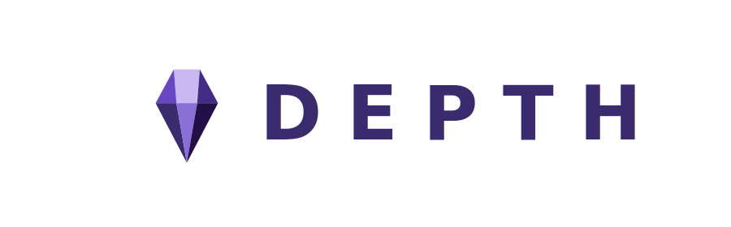

 

<picture>
  <source media="(prefers-color-scheme: dark)" srcset=".github/assets/depth-lockup-h-dark.svg">
  
</picture>

  

 

A desktop companion for competitive Valorant. Rank, Depth Score and match history for
every player in your lobby, surfaced automatically from the moment agent select opens.

 

 

## Features

<table>
<tr>
<td width="33%" valign="top">

### ⚡ Rank Intelligence
Current rank, peak rank, and exact RR for all 10 players. Immortal+ players show their precise RR at seasonal peak.

</td>
<td width="33%" valign="top">

### 🎯 Depth Score
A composite performance metric derived from recent match data. See who's actually playing well right now, not just their rank.

</td>
<td width="33%" valign="top">

### 📈 Win / Loss Streaks
Each player shows their current streak inline. Spot the enemy on W5 or the teammate already tilting on L4 before a round is played.

</td>
</tr>
<tr>
<td width="33%" valign="top">

### 🛡 Dodge Detector
A scored should-you-dodge recommendation built from your team's flags, rank spread, and recent history. **SAFE → DODGE** in one glance.

</td>
<td width="33%" valign="top">

### 🚩 Player Flags & Tags
Community flags for cheaters, win traders, and boosted accounts, plus personal tags and private notes you can attach to any player.

</td>
<td width="33%" valign="top">

### 🔒 InstaLocker
Select your agent once. Depth locks it the instant agent select opens, with a randomised human-like delay.

</td>
</tr>
</table>

 

## Screenshots

<table>
<tr>
<td align="center" width="33%">
 
<b>Lobby</b>
</td>
<td align="center" width="33%">
 
<b>Agent Select</b>
</td>
<td align="center" width="33%">
 
<b>Live Game</b>
</td>
</tr>
<tr>
<td align="center" width="33%">
 
<b>Match History</b>
</td>
<td align="center" width="33%">
 
<b>Player Search</b>
</td>
<td align="center" width="33%">
 
<b>Settings</b>
</td>
</tr>
</table>

 

## Download

### [↓ Download for Windows](https://github.com/psilde/depth-public/releases/latest)

`Windows 10 / 11` · `Valorant installed` · `No account required` · `Free`

 

## How It Works

**1. Launch Depth**
Open before or after Valorant. Depth detects your running game client automatically. No configuration needed.

**2. Queue Up**
Find a match from Depth or Valorant, it doesn't matter. As players enter your lobby, Depth begins fetching their data in the background.

**3. Know Your Lobby**
By agent select, every player's rank and profile is loaded. Click any row for the full stat breakdown. You enter every match informed.

 

## Built With

- 🦀 [Tauri](https://tauri.app) — native desktop shell, minimal system footprint
- ⚛️ [React](https://react.dev) + TypeScript — UI layer
- 📡 [HenrikDev API](https://docs.henrikdev.xyz) — Valorant rank and match data

 

Depth is not affiliated with, endorsed by, or sponsored by Riot Games. 
Valorant and all related marks are trademarks of Riot Games, Inc.

